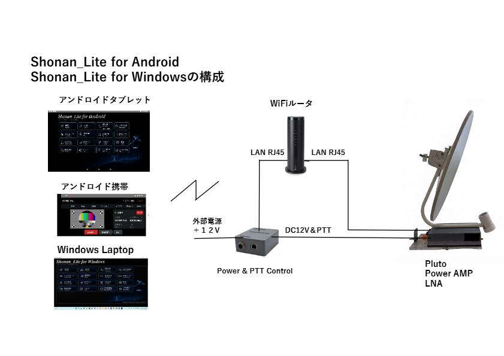
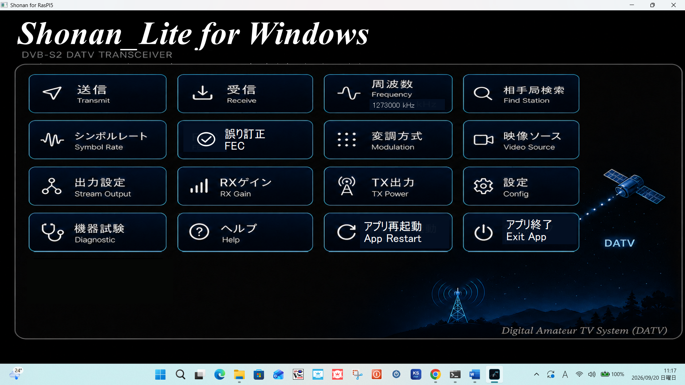
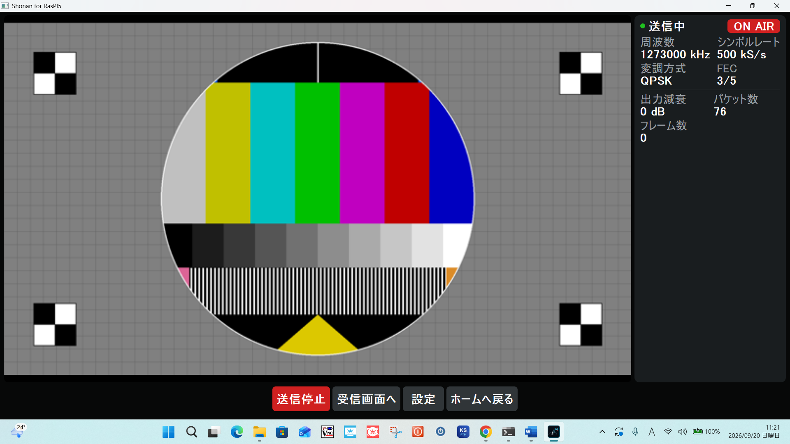
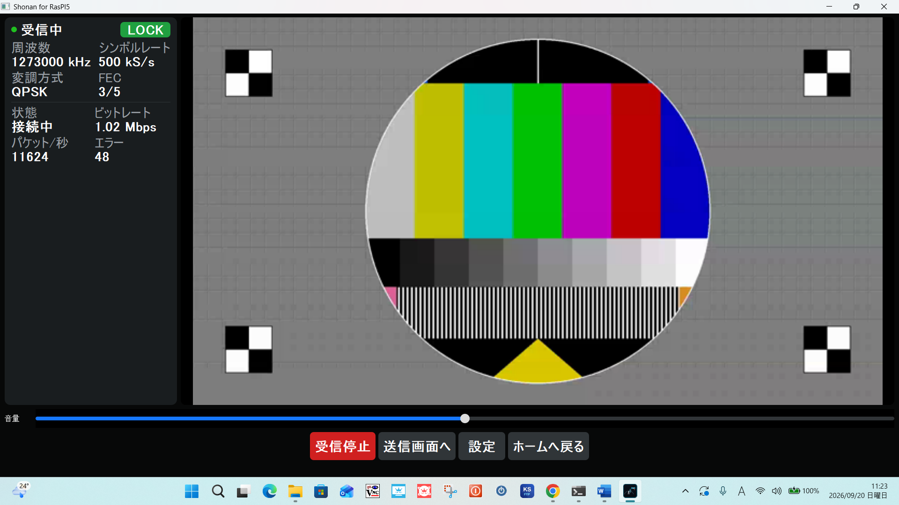
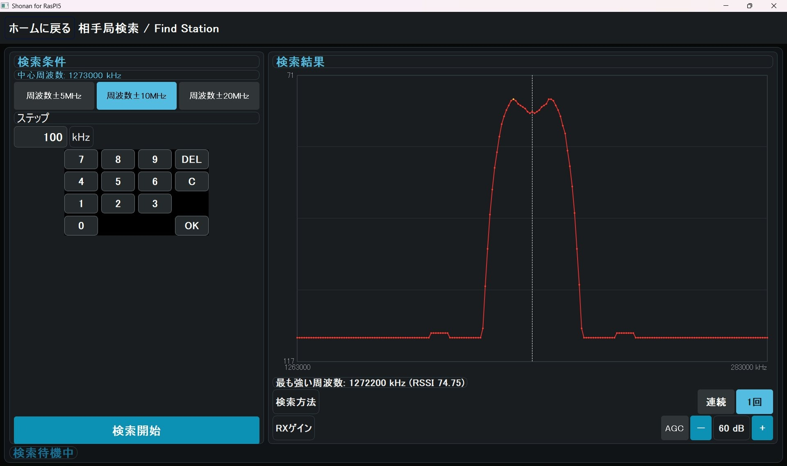

# Shonan_Lite for Windows

## 主な機能 / Features

- **DVB-S2 DATV送信 / DVB-S2 DATV transmission**: 周波数・シンボルレート・FEC(1/4〜9/10)・変調方式
  (QPSK/8PSK/16APSK)・TX出力を画面から設定して送信。カメラ/キャプチャ
  またはテストパターン映像を送出できる。  
  Set the frequency, symbol rate, FEC (1/4 to 9/10), modulation (QPSK/8PSK/16APSK) and TX power
  on screen and transmit. A camera/capture device or a test pattern can be sent.
- **DVB-S2 DATV受信 / DVB-S2 DATV reception**: GNU Radio(gr-dvbs2rx)によるオンデバイス復調。LOCK状態・
  実測ビットレート・パケット数/エラー数をリアルタイム表示。  
  On-device demodulation with GNU Radio (gr-dvbs2rx). The LOCK state, measured bitrate and
  packet/error counts are shown in real time.
- **RSSI測定 / RSSI measurement**: 指定レンジ(±5/10/20MHz)をスキャンし、RSSIグラフと
  中心周波数の表示で相手局の実際の周波数を素早く特定できる。  
  Scans a chosen range (±5/10/20 MHz) and quickly identifies the other station's actual frequency
  with an RSSI graph and the center-frequency marker.
- **RXゲイン/TX出力調整 / RX gain and TX power**: AGC ON/OFFと手動ゲイン、送信出力(0〜-70dB)を画面から調整。  
  Adjust AGC ON/OFF, manual gain and the transmit output (0 to -70 dB) on screen.
- **PA_Power/PTTコントローラ連携(任意) / PA_Power/PTT controller link (optional)**: ESP32+W5500と連携し、送信開始/終了・
  アプリ起動/終了に合わせてPTT・12V電源を自動制御。  
  Works with an ESP32 + W5500 to switch PTT and the 12 V power automatically with TX start/stop
  and app start/exit.
- **オンデバイス復調ON時は送受信同時実行 / Simultaneous TX/RX with on-device demodulation ON**:
  OFF時は排他制御。  
  When OFF, TX and RX are exclusive.
- **日本語/English表示切替 / Japanese/English display switching**: 設定画面で切り替え。全画面に即時反映。
  タッチ操作に最適化したUI。  
  Switch on the Settings screen; applied to every screen immediately. The UI is optimized for touch operation.
- **Pi5実機専用機能 / Pi 5-only features**: 起動時Pluto自動再起動、Pluto電源サイクル、
  運用プリセット(Windows版では非対応)。  
  Automatic Pluto restart at startup, Pluto power cycle and operating presets
  (not supported in the Windows edition).

## システム構成 / System configuration

Shonan_Lite for Android / Shonan_Lite for Windows共通のシステム構成。Pluto
(Power AMP・LNA付き)をWiFiルータ経由でアンドロイド端末やWindows PCから制御し、
Power & PTT Controlユニットが送受信切替(PTT)とPluto/Power AMP系統への
外部12V電源のON/OFFを行う。

Common system configuration for Shonan_Lite for Android / Shonan_Lite for Windows.
A Pluto (with a power amp and LNA) is controlled over Wi-Fi from an Android device or
a Windows PC. The Power & PTT Control unit switches TX/RX (PTT) and turns the external
12 V power to the Pluto/power amp chain on and off.



## スクリーンショット / Screenshots

Windows版(実機PlutoでのTX→RXループバック動作確認時のもの)。

Windows edition (captured during an actual Pluto TX→RX loopback check).

| Home画面 / Home | 送信画面(TX) / Transmit (TX) |
| --- | --- |
|  |  |

| 受信画面(RX、LOCK) / Receive (RX, LOCK) | RSSI測定 / RSSI measurement |
| --- | --- |
|  |  |

## インストール / Installation

### 方法1: 配布インストーラを使う(推奨) / Method 1: Use the distributed installer (recommended)

[Releases](https://github.com/kazushinjo/Shonan_Lite-win/releases)から
`ShonanLiteSetup.exe`をダウンロードして実行する。アプリ本体・ffmpeg・
GNU Radio実行環境(radioconda)・受信復調用gr-dvbs2rxを一括で導入するため、
追加のセットアップは不要（radiocondaの展開に数分かかる）。

Download `ShonanLiteSetup.exe` from [Releases](https://github.com/kazushinjo/Shonan_Lite-win/releases)
and run it. It installs the app, ffmpeg, the GNU Radio runtime (radioconda) and gr-dvbs2rx for
reception demodulation in one go, so no additional setup is needed (extracting radioconda takes a few minutes).

- 対応OS: Windows 10/11 (x64)。32bit環境は非対応。  
  Supported OS: Windows 10/11 (x64). 32-bit environments are not supported.
- インストール後、スタートメニュー/デスクトップの「Shonan_Lite for Windows」から起動する。  
  After installation, launch it from "Shonan_Lite for Windows" in the Start menu or on the desktop.
- アンインストールはWindowsの「設定」→「アプリ」から行う。radioconda自体は
  別アプリとして導入されるため、不要なら別途アンインストールする。  
  Uninstall from Windows "Settings" -> "Apps". radioconda is installed as a separate app, so
  uninstall it separately if you no longer need it.
- インストーラが導入する内容・手順の詳細、トラブルシューティングは
  [`docs/install_manual_windows.md`](docs/install_manual_windows.md)を参照。  
  For the details of what the installer installs, the procedure and troubleshooting, see
  [`docs/install_manual_windows.md`](docs/install_manual_windows.md).

### 方法2: GitHubからのインストール(ソースから実行) / Method 2: Install from GitHub (run from source)

開発・改造目的でソースから直接実行する場合の手順。

Steps for running directly from source for development or modification.

事前にGitとPython 3(Windows用のPythonランチャー`py`を含む。動作確認済みバージョン: 3.14)をインストールしておく。

Git and Python 3 (including the Windows Python launcher `py`; verified with 3.14) must be installed beforehand.

```powershell
git clone https://github.com/kazushinjo/Shonan_Lite-win.git
cd Shonan_Lite-win
py -m venv .venv-win
.venv-win\Scripts\pip install -r requirements-win.txt
.venv-win\Scripts\python app\gui\main.py
```

映像/音声入出力にはffmpegが必要（PATHに通っていること）:

ffmpeg is required for video/audio input and output (it must be on the PATH):

```powershell
winget install --id Gyan.FFmpeg
```

`winget`で導入した直後は、すでに開いているPowerShellのPATHに反映されない場合がある。その場合はPowerShellを開き直してからGUIを起動する。

Right after installing with `winget`, the PATH of an already-open PowerShell may not be updated. If so, reopen PowerShell before launching the GUI.

受信(RX)復調にはGNU Radio + gr-iio + gr-dvbs2rxが別途必要。radiocondaの
導入とgr-dvbs2rxのビルド手順は
[`docs/gr-dvbs2rx-windows/README.md`](docs/gr-dvbs2rx-windows/README.md)
を参照(受信を使わない場合は不要。送信のみなら`requirements-win.txt`と
ffmpegだけで動作する)。

Reception (RX) demodulation additionally requires GNU Radio + gr-iio + gr-dvbs2rx. For installing
radioconda and building gr-dvbs2rx, see
[`docs/gr-dvbs2rx-windows/README.md`](docs/gr-dvbs2rx-windows/README.md)
(not needed if you do not use reception; for transmission only, `requirements-win.txt` and ffmpeg are enough).

### 方法3: ローカルクローンからのインストール / Method 3: Install from a local clone

GitHubへのアクセスができない環境(オフライン現場など)では、あらかじめ
USB/社内ネットワーク等で転送済みのローカルコピーからセットアップする。
`git clone`を行わない点以外は方法2と同じ:

In environments without access to GitHub (e.g. offline sites), set up from a local copy that was
transferred beforehand by USB or an internal network. Identical to Method 2 except that no
`git clone` is done:

```powershell
# 転送済みのローカルコピーへ移動(例) / Move to the transferred local copy (example)
cd D:\shonan-win-src

py -m venv .venv-win
.venv-win\Scripts\pip install -r requirements-win.txt
.venv-win\Scripts\python app\gui\main.py
```

`pip install`自体もインターネット接続を必要とするため、完全オフラインで
セットアップする場合は、あらかじめ`pip download -r requirements-win.txt -d wheels`
で依存パッケージを別PCでダウンロードして同梱し、
`pip install --no-index --find-links wheels -r requirements-win.txt`
に置き換える。ffmpeg・radioconda・gr-dvbs2rxも同様に事前ダウンロード済みの
インストーラ/成果物を転送しておく必要がある(方法1の配布インストーラは
これらを1本にまとめたもので、この手動転送の手間を避けられる)。

`pip install` itself needs an Internet connection, so for a fully offline setup, download the
dependencies beforehand on another PC with `pip download -r requirements-win.txt -d wheels`, bring
them along, and replace the install command with
`pip install --no-index --find-links wheels -r requirements-win.txt`.
ffmpeg, radioconda and gr-dvbs2rx likewise need their installers/artifacts downloaded and transferred
in advance (the distributed installer of Method 1 bundles all of these into one file and avoids this
manual transfer).

### インストーラの自前ビルド / Building the installer yourself

配布インストーラ(`ShonanLiteSetup.exe`)はPyInstaller(GUI本体の凍結)と
Inno Setup 6(ffmpeg・radioconda・事前ビルド済みgr-dvbs2rxの同梱)で作成する。
ビルドはスクリプト1本で行える([`build_installer/README.md`](build_installer/README.md)に詳細):

The distributed installer (`ShonanLiteSetup.exe`) is built with PyInstaller (freezing the GUI) and
Inno Setup 6 (bundling ffmpeg, radioconda and the prebuilt gr-dvbs2rx).
The build is done with a single script (details in [`build_installer/README.md`](build_installer/README.md)):

```powershell
powershell -ExecutionPolicy Bypass -File build_installer\build_installer.ps1
```

事前に次を導入しておく / Install the following beforehand:

- Git、Python 3(`py`ランチャー付き) / Git and Python 3 (with the `py` launcher)
- Inno Setup 6: `winget install --id JRSoftware.InnoSetup`
- ffmpeg: `winget install --id Gyan.FFmpeg`
- radioconda 2025.03.14とビルド済みのgr-dvbs2rx([`docs/gr-dvbs2rx-windows/README.md`](docs/gr-dvbs2rx-windows/README.md)参照) /
  radioconda 2025.03.14 and a built gr-dvbs2rx (see [`docs/gr-dvbs2rx-windows/README.md`](docs/gr-dvbs2rx-windows/README.md))

成果物は`build_installer\output\ShonanLiteSetup.exe`(約700MB、圧縮に数分〜10分程度かかる)。  
The result is `build_installer\output\ShonanLiteSetup.exe` (about 700 MB; compression takes a few to ten minutes).

## 動作確認クイックスタート / Function check quick start

Windows PC上でPlutoのTX→RXをループバックして、送信〜受信の動作を確認する最短手順。

The shortest procedure to check transmission and reception on a Windows PC by looping the Pluto's TX back to its RX.

### 事前準備 / Preparation

- Plutoはファームウェアv0.32-dirtyを用意する。  
  Prepare a Pluto with firmware v0.32-dirty.
- PlutoのTX端子とRX端子の間に40dBのアッテネータを接続する。  
  Connect a 40 dB attenuator between the Pluto's TX and RX ports.

### 手順 / Steps

1. `ShonanLiteSetup.exe`を実行してインストールする([インストール](#インストール--installation)参照)。  
   Run `ShonanLiteSetup.exe` to install (see [Installation](#インストール--installation)).
2. **設定**で「オンデバイス復調 (GNU Radio)」をオンにする。  
   In **Settings**, turn on "On-device demodulation (GNU Radio)".
3. **映像ソース**で「テストパターン」を選択する。  
   In **Video source**, select "Test pattern".
4. **変調方式**で「QPSK」を選択する。  
   In **Modulation**, select "QPSK".
5. **誤り訂正(FEC)**で「3/5」を選択する。  
   In **FEC**, select "3/5".
6. **出力設定**でPluto URIの「自動検出」をクリックする。  
   In **Output settings**, click "Detect" next to the Pluto URI.
7. **シンボルレート**で「500K」を選択する。  
   In **Symbol rate**, select "500K".
8. **周波数**で「1273MHz」を選択する。  
   In **Frequency**, select "1273 MHz".
9. **TX出力**は「0dB」(既定値)のままにする。  
   Leave **TX power** at "0 dB" (the default).
10. **RXゲイン**は「60dB」(既定値)のままにする。  
    Leave **RX gain** at "60 dB" (the default).
11. 送信画面で「送信開始」をクリックすると送信が始まる(ON AIR表示)。  
    On the TX screen, click "Start TX" to start transmitting (shown as ON AIR).

    

12. 「受信画面へ」をクリックする。  
    Click "Go to RX".
13. 「受信開始」をクリックすると受信が始まる。数秒でLOCKし、テストパターン映像が表示される。  
    Click "Start RX" to start receiving. It locks within a few seconds and the test pattern video appears.

    

これで送受信の基本動作が確認できる。RSSI測定で実際にTX信号のピークをスキャンした例:  
This confirms the basic TX/RX operation. Example of RSSI Measurement actually scanning and finding the TX signal peak:


## Windows PC用実運用クイックスタートガイド / Windows PC real-operation quick start guide

上記のクイックスタートはPC単体でのTX→RXループバック確認用。実際にPlutoを
アンテナに接続して運用する場合の手順は以下の通り(オンデバイス復調はOFFの
ままなので、TX/RXは同時ではなく片方ずつ使う)。

The quick start above is for a TX→RX loopback check on a single PC. The steps below are for
actual operation with a Pluto connected to an antenna (on-device demodulation stays OFF, so
TX and RX are used one at a time, not simultaneously).

### 事前準備 / Preparation

- Plutoはファームウェアv0.32-dirtyを用意する。  
  Prepare a Pluto with firmware v0.32-dirty.
- USB-イーサネットアダプタを接続する。（電源を忘れずに繋ぐ）  
  Connect a USB-Ethernet adapter. Don't forget to connect power.

または / or

- データ通信用USBケーブルでPCに接続する。  
  Connect it to the PC with a data USB cable.

### 手順 / Steps

1. `ShonanLiteSetup.exe`をインストールする。  
   Install `ShonanLiteSetup.exe`.
2. **設定**で「オンデバイス復調 (GNU Radio)」にチェックが入っていないことを確認する。  
   In **Settings**, confirm "On-device demodulation (GNU Radio)" is unchecked.
3. **映像ソース**で「カメラ」を選択する。  
   In **Video source**, select "Camera".
4. **変調方式**で「QPSK」を選択する。  
   In **Modulation**, select "QPSK".
5. **誤り訂正(FEC)**で「3/5」を選択する。  
   In **FEC**, select "3/5".
6. **出力設定**でPluto URIの「自動検出」をクリックする。  
   In **Output settings**, click "Detect" next to the Pluto URI.
7. **シンボルレート**で「500K」を選択する。  
   In **Symbol rate**, select "500K".
8. **周波数**で「1273MHz」を選択する。（実際の運用周波数に変更）  
   In **Frequency**, select "1273 MHz". Change it to your actual operating frequency.
9. **TX出力**は「0dB」(既定値)のままにする。  
   Leave **TX power** at "0 dB" (the default).
10. **RXゲイン**は「60dB」(既定値)のままにする。  
    Leave **RX gain** at "60 dB" (the default).
11. 送信する場合: Home画面で「送信」をクリックし、「送信開始」をクリックすると送信が始まる。  
    To transmit: on the Home screen, click "Transmit", then click "Start TX" to begin transmitting.

    または / or

    受信する場合: Home画面で「受信」をクリックし、「受信開始」をクリックすると受信が始まる。  
    To receive: on the Home screen, click "Receive", then click "Start RX" to begin receiving.

## 関連ドキュメント / Related documents

- [`docs/install_manual_windows.md`](docs/install_manual_windows.md) — 配布インストーラの完全インストールマニュアル /  
  Complete installation manual for the distributed installer
- [`docs/gr-dvbs2rx-windows/README.md`](docs/gr-dvbs2rx-windows/README.md) — gr-dvbs2rxを自分でビルドする手順(開発者向け) /  
  How to build gr-dvbs2rx yourself (for developers)
- [`docs/rssi-measurement/README.md`](docs/rssi-measurement/README.md) — RSSI測定の変更仕様と差分(他の版へ移植する際の記録) /  
  RSSI Measurement change specification and patch (a record for porting to other editions)
- 操作説明書(Word) / Operation manual (Word): `app/docs/shonan_lite_win_operation_manual.docx`(日本語 / Japanese),  
  `app/docs/shonan_lite_win_operation_manual_en.docx`(English) —
  生成スクリプト / generator: [`app/docs/build_operation_manual_win.py`](app/docs/build_operation_manual_win.py)
- GUIの操作説明書(アプリ内Helpと同内容) / GUI operation manual (same content as the in-app Help):
  [`app/gui/manual_content_win.py`](app/gui/manual_content_win.py)(日本語 / Japanese),
  [`app/gui/manual_content_win_en.py`](app/gui/manual_content_win_en.py)(English)
- [`app/third_party/rpi-dvbs2-receiver-gui/`](app/third_party/rpi-dvbs2-receiver-gui/) — GNU Radio/gr-dvbs2rx受信フローグラフの参考実装(kazushinjo/rpi-dvbs2-receiver-guiより取り込み) /  
  Reference implementation of the GNU Radio/gr-dvbs2rx receive flowgraph (imported from kazushinjo/rpi-dvbs2-receiver-gui)

## クレジット / Credits

- 受信部の方式考案・受信部原システム設計: 山崎慎慈氏(JE1BTA)
  rpi-dvbs2-receiver-guiの設計に基づきます  
  Reception method concept and original reception-subsystem design: Shinji Yamazaki (JE1BTA).
  Based on the design of rpi-dvbs2-receiver-gui.
- 受信部安定化調査修正・再捕捉修正・本アプリ開発: 真城和一  
  Reception stability investigation and fixes, re-acquisition fixes, and development of this app: Kazuichi Shinjo

## 免責事項 / Disclaimer

1. **無保証・自己責任 / No warranty; use at your own risk**  
   本ソフトウェアは現状のまま(AS IS)で提供され、動作、品質、特定の目的への適合性を含め、いかなる保証もありません。本ソフトウェアの使用または使用できないことによって生じた、機器の破損、データの消失、電波障害、その他一切の損害について、開発者は責任を負いません。ご自身の責任においてご利用ください。  
   This software is provided "AS IS" without warranty of any kind, including any warranty of operation, quality or fitness for a particular purpose. The developers accept no liability for any damage arising from the use of, or inability to use, this software, including damage to equipment, loss of data and radio interference. Use it at your own risk.
2. **免許と法令の順守 / Licensing and compliance with the law**  
   本ソフトウェアは、アマチュア無線のDATV(デジタルATV)実験のための送受信ソフトウェアです。電波を送信するには、運用する国・地域の法令に基づく免許が必要です(日本国内ではアマチュア局の免許)。周波数、空中線電力、電波の型式、運用できる範囲などの法令(日本国内では電波法および関係規則)を守ってください。免許のない送信や、免許の範囲を超えた送信は、法令違反となることがあります。本ソフトウェアは、設定された周波数・出力・変調方式が法令に適合していることを確認も保証もしません。送信の内容と結果は、すべて使用者の責任です。  
   This software is for amateur-radio DATV (digital ATV) experiments. Transmitting requires a license under the laws of the country or region where you operate (in Japan, an amateur station license). Observe the applicable laws on frequency, transmitter power, emission type and permitted operation (in Japan, the Radio Act and related regulations). Transmitting without a license, or beyond the scope of your license, may violate the law. This software neither checks nor guarantees that the configured frequency, power and modulation comply with the law. You are solely responsible for what you transmit and for the results.
3. **機器の取り扱い / Handling of equipment**  
   TXとRXの接続、外部アンプ(PA)・アッテネータ・アンテナの接続、送信出力の設定を誤ると、機器を破損したり、他の無線局へ障害を与えたりするおそれがあります。機器の仕様を確認し、使用者の責任で行ってください。特に、TXをRXへ直接接続せず、40 dB以上の減衰器を介してください。  
   Wrong TX/RX connections, external amplifier (PA), attenuator or antenna connections, or transmit power settings may damage equipment or interfere with other stations. Check the specifications of your equipment and do this at your own responsibility. In particular, never connect TX directly to RX; use an attenuator of 40 dB or more.
4. **第三者ソフトウェアとライセンス / Third-party software and license**  
   本ソフトウェアは、ffmpeg、GNU Radio(radioconda)、gr-dvbs2rx、Qt(PyQt5)などの第三者ソフトウェアを利用・同梱します。それぞれのライセンスに従います。本ソフトウェア自体は GNU General Public License v3.0(GPLv3)の下で提供されます。ライセンス全文は同梱の LICENSE を参照してください。  
   This software uses and bundles third-party software such as ffmpeg, GNU Radio (radioconda), gr-dvbs2rx and Qt (PyQt5), each under its own license. This software itself is provided under the GNU General Public License v3.0 (GPLv3). See the bundled LICENSE for the full text.
5. **動作について / About behavior**  
   ご使用の環境によって動作が異なる場合や、未発見の不具合が含まれる可能性があります。  
   Behavior may differ depending on your environment, and undiscovered defects may remain.

## ライセンス / License

本ソフトウェアはGNU General Public License v3.0 (GPLv3)の下でライセンスされています。ライセンス全文は[`LICENSE`](LICENSE)を参照。

This software is licensed under the GNU General Public License v3.0 (GPLv3). See [`LICENSE`](LICENSE) for the full text.

- Reception subsystem design (Shinji Yamazaki, JE1BTA): GPLv3
- Application development, reception stability fixes (Kazuichi Shinjo): GPLv3
